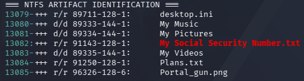

# Windows Artifact Identification and File Recovery

## Investigation Overview

This examination focused on identifying Windows user activity and correlating Registry artifacts with NTFS file system records.

The investigation was conducted using Kali Linux, RegRipper, and The Sleuth Kit.

## Windows RecentDocs Analysis

The NTUSER.DAT Registry hive was examined using the RegRipper recentdocs plugin.

The following Registry location was analyzed:

`Software\Microsoft\Windows\CurrentVersion\Explorer\RecentDocs`

The analysis identified several recently recorded files, including:

- Portal_gun.png
- Jessica.jpg
- My Social Security Number.txt
- Plans.txt
- Thoughts.txt

### Relevant Registry Timestamps

| Registry Key | LastWrite (UTC) |
|---|---|
| RecentDocs | 2020-09-18 23:07:44 |
| RecentDocs\\.txt | 2020-09-18 22:50:36 |

These timestamps describe modifications to the Registry keys. They should not be interpreted as exact file-opening timestamps.

## NTFS File System Correlation

The NTFS file listing was examined to locate a corresponding file system record.

The examination identified the relevant file with the following metadata:

| Attribute | Finding |
|---|---|
| File | My Social Security Number.txt |
| MFT Record | 91143 |
| Attribute Type | 128 ($DATA) |
| Attribute ID | 1 |
| File Type | Regular file |

The file was identified in the NTFS listing using the following command:

```bash
grep -in -C 3 "My Social Security Number.txt" ntfs_full_listing.txt
```

The matching record provided a file system reference that could be used for further forensic examination.

## File System Enumeration

The saved file analysis summary reported:

| Category | Count |
|---|---:|
| Total files | 100697 |
| Executables | 2748 |

These counts describe the results recorded during the examination of partition 3.

## Forensic Significance

The investigation demonstrated how Windows Registry artifacts can be correlated with NTFS metadata to identify files associated with recorded user activity.

RecentDocs provided evidence that Windows maintained a recent-document reference to the relevant file.

The NTFS listing independently identified a corresponding file system record.

Together, these artifacts support the reconstruction of user activity and help identify files for further forensic examination.

## Evidence Protection

The recovered file's contents have been excluded from this public report to prevent disclosure of potentially sensitive personal information.

Only the investigative methodology and relevant technical metadata are documented.

## Independent NTFS Artifact Recovery and Verification

### Artifact Identification

Windows RecentDocs analysis identified a document named `My Social Security Number.txt`. Examination of the NTFS file listing correlated the filename with MFT record `91143`.

Because the filename indicates potentially sensitive personal information, the recovered content was retained in the private forensic workspace and was not included in the public repository.

### Partition Identification

The Sleuth Kit `mmls` utility identified a GUID Partition Table (GPT). The main NTFS Basic Data partition began at sector `239616`, using 512-byte sectors.

```bash
sudo mmls /mnt/ewf/ewf1
```

### Independent Recovery

The file was extracted from the reconstructed EWF image using The Sleuth Kit `icat` utility:

```bash
sudo icat -o 239616 \
/mnt/ewf/ewf1 91143 \
> /home/forensics/Cases/Week3/Analysis/recovered_file_verification.txt
```

The newly recovered artifact was identified as ASCII text with CRLF line endings.

### Verification

SHA-256 hashes were calculated for the previously extracted file and the independently recovered verification copy:

```bash
sha256sum \
/home/forensics/Cases/Week3/Documentation/extracted_ssn_file.txt \
/home/forensics/Cases/Week3/Analysis/recovered_file_verification.txt
```

Both files produced matching SHA-256 values. A byte-for-byte comparison using `cmp` produced no reported differences:

```bash
cmp \
/home/forensics/Cases/Week3/Documentation/extracted_ssn_file.txt \
/home/forensics/Cases/Week3/Analysis/recovered_file_verification.txt
```

**Finding:** The independent recovery reproduced the previously extracted file. The matching hashes and byte-for-byte comparison support the integrity and repeatability of the artifact recovery procedure.

**Privacy note:** The recovered file's contents and copies of the file were excluded from this public case study.

## Supporting Screenshot: MFT Artifact Identification

The recursive NTFS file listing was searched for the document
identified during the investigation.

The resulting entry identified MFT record `91143` and the
NTFS `$DATA` attribute reference `128-1`.



**Figure 4.** Reproduced NTFS file-listing examination showing
the target document associated with MFT record `91143`.

